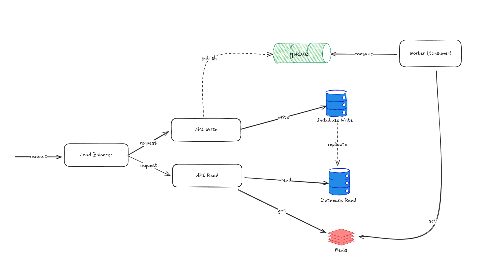

# Twitter Demo

A Twitter demo application built with Go, using clean architecture with layer separation (Repository, Usecase, Controller).

## Twitter System Design Implementation

This repository contains the implementation of a simplified microblogging platform, designed with a focus on **horizontal scalability** and **read optimization** (High Read Throughput).

The project solves the technical challenge by proposing a distributed architecture that separates read and write responsibilities, using asynchronous patterns to ensure performance under high demand.

## Architecture and Design

The system is designed under the principle that in a social network like Twitter, **read operations massively outnumber write operations**.



### Scalability Strategy

The architecture is designed to scale to millions of users through the following key components:

1.  **API Gateway & Horizontal Scaling:** Single entry point that routes traffic to multiple stateless instances of Write API, Read API, and Search Service. Services can scale independently based on demand.

2.  **CQRS Pattern:** Separates Write API (content creation) from Read API (timeline queries), allowing independent scaling of each. The Read API handles most of the traffic without over-provisioning the Write infrastructure.

3.  **Database Sharding:** Data is partitioned across multiple shards using User ID as the sharding key, eliminating single database bottlenecks.

4.  **Graph Database:** Stores social relationships (followers/following) optimized for graph traversal operations, outperforming traditional JOIN queries.

5.  **Full-Text Search Engine:** Elasticsearch/Solr handles search operations (hashtags, users, content) with inverted indexes. Content is indexed asynchronously via Kafka.

6.  **Object Storage & CDN:** Multimedia files are stored in S3-compatible storage and served globally through CDN edge locations for low latency.

7.  **Fan-Out on Write:** Tweets are pre-calculated and pushed to followers' timelines asynchronously via Kafka Workers, avoiding real-time JOIN operations.

8.  **Multi-Layer Cache:** Redis instances cache timelines, user profiles, and metadata. Uses hybrid push (fan-out) and pull (cache-aside) strategies with eventual consistency.

### Data Flow

#### Write Flow (Creating a Tweet):
1.  **Request:** User sends a request to create a tweet through the Web Application.
2.  **Routing:** The Load Balancer forwards the request to the **API Gateway**.
3.  **API Gateway:** Routes the request to an available **Write API** instance.
4.  **Persistence:** Write API persists the tweet in the appropriate **Database Shard** (based on User ID sharding key).
5.  **Event Publishing:** Write API publishes a `tweet.created` event to **Kafka**.
6.  **Media Handling:** If the tweet contains media, files are uploaded to **Object Storage** and URLs are stored in the database.
7.  **Asynchronous Processing:**
    * **Worker (Consumer)** reads the `tweet.created` event from Kafka.
    * Updates the **Cache (Redis)** with the tweet for active followers (Fan-Out).
    * Updates the **Full-Text Search Engine** index for searchability.
8.  **CDN Cache:** Media URLs are cached at **CDN** edge locations for fast delivery.

#### Read Flow (Timeline Query):
1.  **Request:** User requests their timeline through the Web Application.
2.  **Routing:** Load Balancer → **API Gateway** → **Read API** instance.
3.  **Timeline Service:** Read API delegates to the **Timeline Service**.
4.  **Cache Check:** Timeline Service first queries **Cache (Redis)** for the user's pre-computed timeline (O(1) lookup).
5.  **Cache Hit:** If found, return the cached timeline immediately.
6.  **Cache Miss (Cold Start):**
    * Query **Graph Database** to get the list of followed users.
    * Query relevant **Database Shards** to fetch recent tweets from followed users.
    * Aggregate and sort tweets by timestamp.
    * Store the computed timeline in **Cache** for future requests.
7.  **Response:** Timeline is returned to the user with media URLs pointing to **CDN**.

#### Search Flow:
1.  **Request:** User performs a search (e.g., hashtags, users, content).
2.  **Routing:** Load Balancer → **API Gateway** → **Search Service**.
3.  **Search Query:** Search Service queries the **Full-Text Search Engine** (Elasticsearch/Solr).
4.  **Results:** Search engine returns ranked results based on relevance.
5.  **Enrichment:** Search Service may query **Cache** or **Database Shards** for additional metadata.
6.  **Response:** Enriched search results are returned to the user.

#### Social Graph Flow (Follow/Unfollow):
1.  **Request:** User follows/unfollows another user.
2.  **Routing:** Load Balancer → **API Gateway** → **Write API**.
3.  **Graph Update:** Write API updates the **Graph Database** with the new relationship.
4.  **Event Publishing:** Publishes a `user.followed` or `user.unfollowed` event to **Kafka**.
5.  **Asynchronous Processing:**
    * Worker updates **Cache** to reflect the new relationship.
    * May trigger timeline pre-computation for the follower.

## Code Structure

The project follows the guidelines of the [Standard Go Project Layout](https://github.com/golang-standards/project-layout) and applies **Clean Architecture** principles to isolate business logic from infrastructure.

```text
.
├── cmd/
│   ├── read-api/      # Entrypoint for the Read API
│   ├── write-api/     # Entrypoint for the Write API
│   └── worker/        # Entrypoint for the asynchronous processor
├── internal/
│   ├── domain/        # Pure entities (Enterprise Business Rules)
│   ├── usecase/       # Business logic (Application Business Rules)
│   ├── infrastructure/# Repository implementations (DB, Redis, Kafka)
│   └── interfaces/    # HTTP Controllers and DTOs
├── pkg/               # Shared libraries (DB Drivers, Configs)
└── database/          # Migrations and Seeds
```

## Assumptions and Considerations

For the scope of this challenge, the following assumptions and simplifications have been made:

- **Testing:** Demonstrative unit tests have been included for the main use cases (user, tweet), but 100% coverage is not provided.

- **Fan-Out Scope:** The asynchronous distribution pattern was implemented solely for the tweet.created event as a prototype. In a production system, events like "delete tweet" or "unfollow" should also be emitted to maintain cache consistency.

- **Database Agnosticism**: Although a relational database (PostgreSQL) is used for persistence, the code is decoupled via interfaces, allowing for migration to NoSQL or other engines if data volume requires it.

- **Security**: Security implementations such as password hashing (bcrypt) and authentication (JWT) have been omitted to focus on architecture and scalability patterns. Additionally, sensitive credentials (database passwords, API keys) are written in plain text in the configuration files for demonstration purposes only. In a production environment, these should be managed using secure secret management solutions (e.g., HashiCorp Vault, AWS Secrets Manager, Kubernetes Secrets).

- **Architecture Completeness:** The updated architecture diagram includes advanced scalability components (Database Sharding, Graph Database, Full-Text Search Engine, Object Storage, CDN, and API Gateway) that represent the production-ready design. The current implementation provides the foundational services, with the architecture designed to accommodate these components as the system scales. These components can be integrated incrementally as user load increases.

- **Multimedia Support:** The architecture now includes **Object Storage (S3)** and **CDN** for handling images, videos, and other media files. This allows the system to efficiently serve multimedia content to millions of users globally with low latency.

- **Search Capabilities:** The **Full-Text Search Engine** component is designed to provide fast and relevant search results for hashtags, user mentions, and tweet content using inverted indexes and relevance algorithms.

- **Social Graph Optimization:** The **Graph Database** is specifically designed to handle social relationships (followers, following, mutual connections) with optimal performance for graph traversal operations, which are common in social networks.

## Tech Stack

### Core Services
* **Language:** Go (Golang) 1.25
* **API Gateway:** Nginx, Kong, or AWS API Gateway (for routing and load distribution)
* **Load Balancer:** HAProxy, Nginx, or cloud-native LB (AWS ALB/NLB)

### Data Storage
* **Relational Database:** PostgreSQL with Database Sharding (horizontal partitioning by User ID)
* **Graph Database:** Neo4j or Amazon Neptune (for social relationships and graph traversal)
* **Full-Text Search:** Elasticsearch or Apache Solr (for content search and indexing)
* **Object Storage:** AWS S3, Google Cloud Storage, or MinIO (for multimedia content)

### Caching & Performance
* **Cache / Key-Value Store:** Redis (multiple instances for timelines, user profiles, and metadata)
* **CDN:** CloudFront, Cloudflare, or Akamai (for global content delivery)

### Messaging & Processing
* **Message Broker:** Apache Kafka (for event-driven architecture and asynchronous processing)
* **Worker/Consumer:** Go-based workers for fan-out operations and async tasks

### Infrastructure & Deployment
* **Containerization:** Docker & Docker Compose
* **Orchestration:** Kubernetes (recommended for production horizontal scaling)
* **Monitoring:** Prometheus, Grafana (optional for observability)

## Getting Started

### Prerequisites

- Docker and Docker Compose installed
- Go 1.25+ (for local development)
- Make (optional, for using Makefile commands)

### Running the Project

1. **Clone the repository:**
```bash
git clone https://github.com/DunittMonagas/twitter-demo.git
cd twitter-demo
```

2. **Start all services with Docker Compose:**
```bash
docker-compose up --build
```

This will start:
- **Write API** on port `8081`
- **Read API** on port `8080`
- **Worker** (background processor)
- **PostgreSQL** on port `5432`
- **Redis** on port `6379`
- **Kafka** on ports `9092` (internal) and `9093` (external)
- **Kafka UI** on port `8090` (for monitoring)

3. **Wait for all services to be healthy:**
The first startup may take a few minutes as Docker downloads images and initializes the database.

4. **Verify the services are running:**
```bash
# Check Write API
curl http://localhost:8081/health

# Check Read API
curl http://localhost:8080/health
```

5. **Access Kafka UI (optional):**
Open your browser and navigate to `http://localhost:8090` to monitor Kafka topics and messages.

### Running Locally (Development)

If you prefer to run the services locally without Docker:

```bash
# Install dependencies
go mod download

# Run the Write API
go run cmd/write-api/main.go

# Run the Read API (in another terminal)
go run cmd/read-api/main.go

# Run the Worker (in another terminal)
go run cmd/worker/main.go
```

**Note:** You'll need PostgreSQL, Redis, and Kafka running locally and update the environment variables accordingly.

### Stopping the Services

```bash
# Stop all services
docker-compose down

# Stop and remove volumes (clean slate)
docker-compose down -v
```

## API Examples

Once the services are running, you can interact with the APIs using the following cURL commands:

### User Operations (Write API - Port 8081)

**Create a new user:**
```bash
curl -X POST http://localhost:8081/users \
  -H "Content-Type: application/json" \
  -d '{
    "username": "john_doe",
    "email": "john@example.com",
    "password": "securepassword123"
  }'
```

**Update a user:**
```bash
curl -X PUT http://localhost:8081/users/1 \
  -H "Content-Type: application/json" \
  -d '{
    "username": "john_updated",
    "email": "john.new@example.com",
    "password": "newsecurepassword"
  }'
```

### User Queries (Read API - Port 8080)

**Get all users:**
```bash
curl http://localhost:8080/users
```

**Get user by ID:**
```bash
curl http://localhost:8080/users/1
```

### Tweet Operations (Write API - Port 8081)

**Create a tweet:**
```bash
curl -X POST http://localhost:8081/tweets \
  -H "Content-Type: application/json" \
  -d '{
    "user_id": 1,
    "content": "Hello, Twitter! This is my first tweet."
  }'
```

**Delete a tweet:**
```bash
curl -X DELETE http://localhost:8081/tweets/1
```

### Timeline Queries (Read API - Port 8080)

**Get user timeline (tweets from followed users):**
```bash
# Get timeline for user ID 1
curl http://localhost:8080/timeline/1

# With pagination
curl "http://localhost:8080/timeline/1?limit=10&offset=0"
```

**Get user's own tweets:**
```bash
curl http://localhost:8080/tweets/user/1
```

### Follow Operations (Write API - Port 8081)

**Follow a user:**
```bash
curl -X POST http://localhost:8081/followers \
  -H "Content-Type: application/json" \
  -d '{
    "follower_id": 1,
    "followed_id": 2
  }'
```

**Unfollow a user:**
```bash
curl -X DELETE http://localhost:8081/followers/1/2
```

### Follow Queries (Read API - Port 8080)

**Get user's followers:**
```bash
curl http://localhost:8080/followers/1
```

**Get users that a user is following:**
```bash
curl http://localhost:8080/following/1
```

### Example Workflow

Here's a complete example to test the entire flow:

```bash
# 1. Create two users
curl -X POST http://localhost:8081/users \
  -H "Content-Type: application/json" \
  -d '{"username": "alice", "email": "alice@example.com", "password": "pass123"}'

curl -X POST http://localhost:8081/users \
  -H "Content-Type: application/json" \
  -d '{"username": "bob", "email": "bob@example.com", "password": "pass456"}'

# 2. Alice (ID: 1) follows Bob (ID: 2)
curl -X POST http://localhost:8081/followers \
  -H "Content-Type: application/json" \
  -d '{"follower_id": 1, "followed_id": 2}'

# 3. Bob creates a tweet
curl -X POST http://localhost:8081/tweets \
  -H "Content-Type: application/json" \
  -d '{"user_id": 2, "content": "Hello from Bob!"}'

# 4. Wait a moment for the worker to process the event (fan-out)
sleep 2

# 5. Get Alice's timeline (should contain Bob's tweet)
curl http://localhost:8080/timeline/1
```

## Testing

This project includes comprehensive unit tests with mocks for all layers:

### Testing Dependencies

- **testify**: More readable assertions
- **go-sqlmock**: SQL query mocking
- **gomock**: Interface mock generation

### Running Tests

```bash
# All tests
go test ./...

# Tests with verbose mode
go test -v ./...

# Tests with coverage
go test -cover ./...

# Tests for specific layer
go test -v ./internal/infrastructure/repository/
go test -v ./internal/usecase/
go test -v ./internal/interfaces/controller/
```

### Generating Mocks

Mocks are automatically generated using `mockgen`:

```bash
# Generate all mocks
make generate-mocks

# Clean generated mocks
make clean-mocks
```

### Test Coverage

Current tests cover:

- **Repository Layer**: Tests with sqlmock for database operations
  - SelectByID (success and not found cases)
  - SelectByEmail
  - Insert (success and error cases)
  
- **Usecase Layer**: Tests with mock repository for business logic
  - CreateUser (success, duplicate email, duplicate username)
  - UpdateUser (success, user not found)
  - GetUserByID (success, error)
  
- **Controller Layer**: Tests with mock usecase for HTTP endpoints
  - GetUserByID (200, 400, 500)
  - CreateUser (201, 400, 500)
  - UpdateUser (200)
  - GetAllUsers (200)

## Available Commands

```bash
# Testing
make test              # Run all tests
make test-coverage     # Run tests with coverage
make generate-mocks    # Generate mocks
make clean-mocks       # Clean generated mocks
```